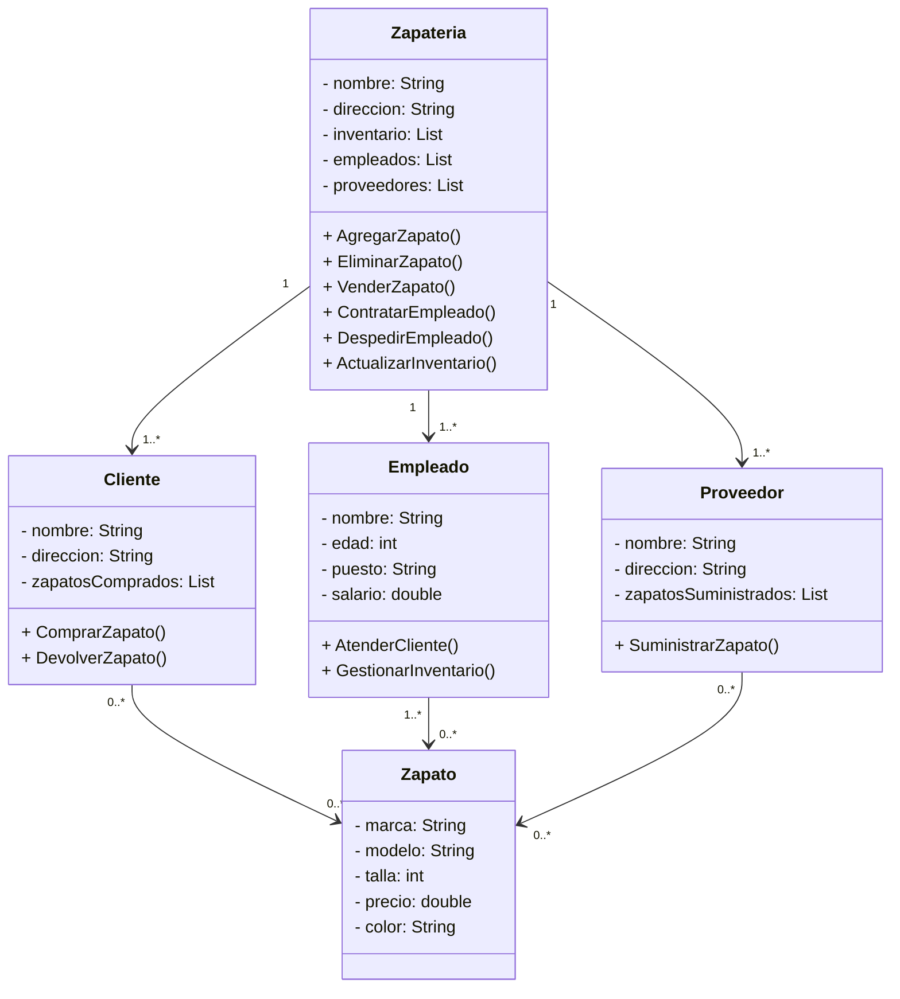

# Reto_2_POO
**Diagrama de clases de una zapateria:**

El diagrama de clases de la zapatería representa la estructura y las relaciones entre las entidades clave en el contexto de una tienda de zapatos. Este diagrama proporciona una visión conceptual del sistema, mostrando las clases principales y cómo interactúan entre sí.

La clase principal es "Zapatería", que tiene atributos como nombre, dirección e inventario de zapatos. La zapatería tiene una relación de uno a muchos con las clases "Empleado", "Cliente" y "Proveedor". Esto significa que una zapatería puede tener varios empleados, clientes y proveedores.

Los clientes interactúan con la zapatería a través de la clase "Cliente", que tiene atributos como nombre, dirección y una lista de zapatos comprados. Los clientes pueden comprar y devolver zapatos a la zapatería.

Los empleados de la zapatería están representados por la clase "Empleado", que tiene atributos como nombre, edad y puesto. Los empleados pueden atender a los clientes y gestionar el inventario de zapatos.

Los proveedores suministran zapatos a la zapatería y están representados por la clase "Proveedor", que tiene atributos como nombre, dirección y una lista de zapatos suministrados.

Los zapatos son la entidad principal del negocio y están representados por la clase "Zapato", que tiene atributos como marca, modelo, talla, precio y color. Los zapatos pueden ser gestionados por empleados, comprados por clientes y suministrados por proveedores.

En resumen, el diagrama de clases de la zapatería proporciona una representación visual de la estructura del sistema y cómo interactúan sus componentes principales, incluyendo la zapatería misma, los clientes, empleados, proveedores y zapatos. Este diagrama sirve como una guía conceptual para comprender la organización y las relaciones dentro del negocio de la zapatería.
